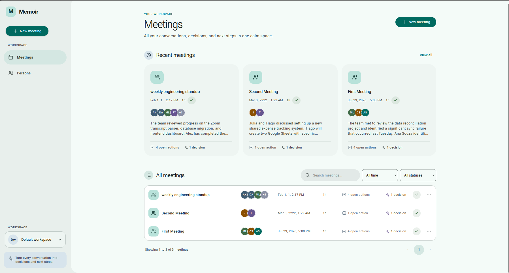

# Memoir
AI-powered workspace that transforms meeting transcripts into searchable organizational knowledge



Memoir helps individuals and small teams organize what happened during their meetings. When a transcript is uploaded, Memoir extracts the summary, participants, actions-items and the decisions made.

> [!NOTE]
> Memoir is currently in early development. The meeting processing workflow is
> functional, but APIs and database models may still change.

## Roadmap

- [x] **Transcript parsing** — format detection, deterministic parsers (Zoom, Google Meet), LLM fallback for messy/unknown formats
- [x] **Storage & Meeting page** — persist transcripts, generate summaries/decisions/action items
- [x] **Person page** — cross-meeting aggregation of participants and their contributions
- [ ] **Ask AI** — Q&A over a single meeting's transcript
- [ ] **Semantic search** — cross-meeting search and Q&A powered by pgvector
- [ ] **Workspace features** — collaboration and org-level tools

## Supported transcript formats

- Zoom
- Google Meet
- Plain text
- Unknown or irregular formats through the LLM fallback parser (Only by gemini api key for now)

## Development

### Quick Commands

Use `make` for common tasks:

```bash
make run-frontend            # Initialize the database and start the app with reload
make run-frontend-clean      # Reset all local data and start the app with reload
make test                     # Run fast tests (quiet)
make test-verbose             # Run fast tests with output (-s flag)
make test-integration         # Run LLM integration test (requires GOOGLE_API_KEY)
make test-integration-verbose # Run integration test with output
make test-all                 # Run all tests
make help                     # Show all commands
```
